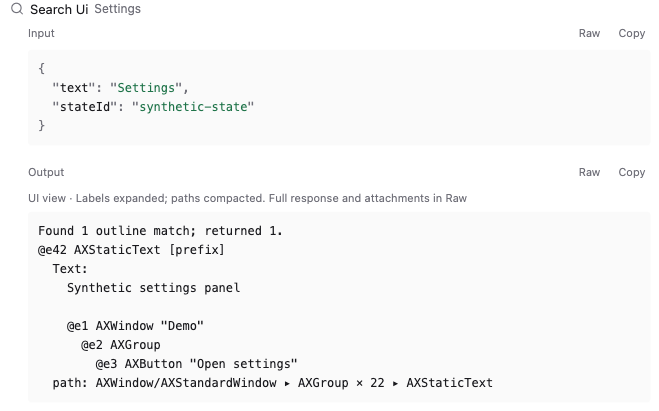
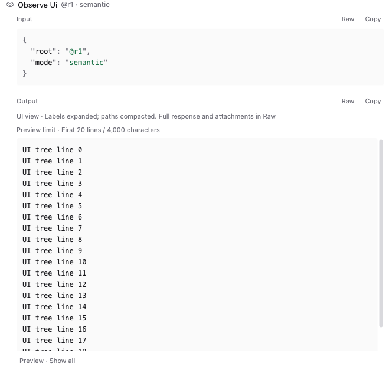
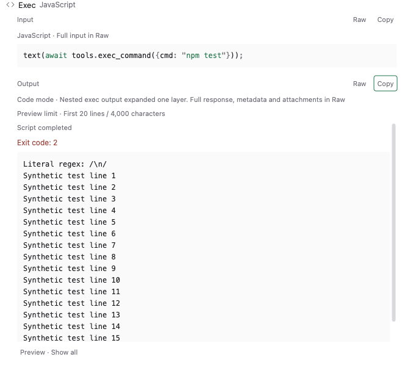

<div align="center">

# Readable Agent Activity

**Readable tool calls. 20-line previews. Full control.**

A Paseo plugin that makes JSON, code and tool output easier to scan — without mounting an entire long result when you open it.

[Install](#install) · [Performance](#smaller-previews-less-rendering-work) · [Technical design](#technical-design) · [Latest beta](https://github.com/geoqiao/paseo-stuff/releases/tag/readable-agent-activity-v0.1.0-beta.5)

</div>

> [!IMPORTANT]
> **Paseo 0.8.0 · Full detail only · Experimental beta.** Summary is not supported. Use Full detail on **every connected client**; disable the plugin before switching to Summary.

<p align="center">
  <a href="images/readable-ui.png"></a>
  <a href="images/bounded-preview.png"></a>
</p>

*Shipped components, synthetic demo data, React Native Web — not host or on-device screenshots. Click either image for the full-size view.*

<details>
<summary>More screenshots: dark, light and compact layouts</summary>

[Dark overview](images/readable-dark.png) · [Light overview](images/readable-light.png) · [Compact layout](images/readable-compact.png)

</details>

## What it solves

| Problem | With this plugin |
| --- | --- |
| Tool arguments and results are hard to scan as dense JSON or escaped strings. | Formatted JSON, highlighted code, readable text blocks and cleaner UI labels/paths. |
| Opening a large tool result can mount thousands of lines and stall the interface. | A **20-line / 4,000-character preview** by default; the rest is rendered only when you choose **Show all**. |
| Long headers and automatic expansion make the timeline noisy. | Short summaries, recognizable icons, and manual-only expansion that survives streaming updates. |

### Tool calls you can actually read

- **JSON:** indented, syntax-highlighted output instead of a dense blob.
- **Code:** known JavaScript inputs render as literal source, not a string buried in JSON.
- **Tool responses:** typed `content` envelopes expose their text; DSH-projected ACP blocks with `type: "content"` and nested text are extracted one layer; attachments, unknown blocks and metadata remain available in Raw.
- **Pi Code mode:** an outer envelope marked `details.codeMode === true` can expose a direct, schema-validated `exec_command` result as its status plus output. This unwraps exactly one layer; exit codes, running sessions and upstream truncation stay visible.
- **UI output:** complete quoted labels decode one layer into readable lines. Repeated paths become `AXWindow ▸ AXGroup × 22 ▸ AXStaticText`.
- **Quiet headers:** specialized icons and bounded, single-line summaries. Native messages, approvals and composer stay native.

**Readable is a view, not a replacement for your data.** Raw retains the complete received response. Copy always copies the **full selected representation**, not just the visible preview: derived text in Readable, complete response in Raw.

<details>
<summary>Nested command output: visible exit status, real lines, preserved escapes</summary>



*Production components, synthetic data. `Script completed` describes the outer JavaScript;
`Exit code: 2` describes the nested command. The plugin does not mistake one for the other.*

</details>

### Smaller previews, less rendering work

A long UI tree or command log should not require rendering its entire body just to inspect the beginning.

```text
Large tool result
      ↓ open
First 20 lines / 4,000 characters
      ↓ Show all — only when you ask
Complete content
      ↓ Show less
Back to the preview
```

The preview bounds the text mounted in each detail section and reasoning body. One **20-line / 4,000-character budget** is shared across every status, text, JSON and unknown-block segment in a result; it does not restart per block. Tools and Thinking also start collapsed, and streaming never opens them for you. A 100,000-line regression case verifies the default preview stays bounded.

This reduces the initial rendering work; **it is not a guarantee of zero lag**. Show all deliberately removes the preview limit. Full Raw, copying, host storage and serialization can still be expensive. The limit counts newline-separated lines, so wrapping can occupy more than 20 visual lines. No pagination, hidden truncation of the source, or claimed FPS benchmark.

## Compatibility: Full detail, not Summary

Paseo 0.8 groups Summary calls **before** running plugin transformers. Its public API does not expose the display mode or group members to this plugin, nor a supported detail-renderer slot for those groups.

Consequently, this is **not** a plugin that automatically stays inactive in Summary. If enabled there, a replacement row can hide the native group's entry point.

- Select **Full detail on all connected clients** before enabling.
- **Disable this plugin before switching to Summary.**
- Do not enable it alongside another tool/reasoning timeline replacement, including upstream Colorful Agent Activity.

Verified with Paseo app, daemon and SDK **0.8.0 on macOS**. The manifest range is `>=0.8.0 <0.9.0`; future 0.8 releases still need verification. The current working tree also passes real RN 0.81.5 Hermes bundle tests after replacing the incompatible eager Shiki loading path. Native iOS/Android UI confirmation is still pending; engine tests and compact browser previews are not on-device UI tests. [Host evidence and compatibility tests](docs/compatibility.md).

## Install

**New repository:** beta.5 includes the native-loading fix and is published from
`geoqiao/paseo-stuff:plugins/agent-activity`. The old standalone beta.4 is unchanged.
Existing installations do not switch sources automatically; read the
[migration notes](https://github.com/geoqiao/paseo-stuff/blob/main/MIGRATION.md).
Do not add a duplicate installation or enable one that is disabled.

> Plugins are **trusted, unsandboxed code**. Review the source before enabling plugins on your daemon. This plugin's runtime is presentation-only, but installation runs npm dependency installation and checks.

1. Set **Full detail** and disable conflicting timeline plugins as described above.
2. Enable plugins in Paseo Settings only if you accept the trust model.
3. Install the pinned beta on your intended daemon:

```sh
paseo plugin add geoqiao/paseo-stuff:plugins/agent-activity --ref readable-agent-activity-v0.1.0-beta.5 --host <your-host>
paseo plugin ls --host <your-host>
```

Replace `<your-host>` with your host address, such as `127.0.0.1:6767` for the standard local daemon. Installation enables the plugin; confirm `readable-agent-activity` is `running`.

Before returning to Summary:

```sh
paseo plugin disable readable-agent-activity --host <your-host>
```

No daemon restart is needed. The tag pins this beta instead of tracking a branch. If you already installed this fork under a custom runtime alias, manage that alias rather than adding an enabled duplicate.

## Technical design

The implementation keeps the renderer small and predictable: **public SDK contributions → pure presentation data → bounded, theme-aware rendering**.

| Design | Why it matters |
| --- | --- |
| **Lexical JSON formatting** | Changes whitespace while preserving received number spellings, duplicate keys, key order and escapes. Structured objects have already lost their original source whitespace. |
| **Explicit format recognition** | Only known code fields, typed content envelopes (including the DSH ACP one-layer text projection), the marked Pi Code-mode exec-result shape and recognized UI labels get special treatment. No source execution, guessed inner tool calls, recursive field walking or global backslash replacement. |
| **Separate work limits** | Formatting input/output and highlighting are capped at 100,000 characters; serialized envelope decoding at 1,000,000. Oversized or unrecognized text falls back to literal content. |
| **Shared diff classification and lazy source access** | Hunk ranges distinguish file headers from `+++`/`---`-looking source lines. Diff counts and colors use the same classifier. Complete edit source and read range metadata stay in Raw without eager serialization for the preview. |
| **Local, manual disclosure** | Expansion and Show all survive streaming/status/theme updates while mounted. Virtual-list remounts reset them; the plugin does not infer host preferences from private storage. |
| **Host-native building blocks** | React Native primitives, public host icons and theme colors. Desktop spacing accounts for Paseo's external row gap; compact mode keeps 44px touch targets. |
| **Presentation-only lifecycle** | No server entry, runtime network requests, process execution or filesystem access. Contributions unregister on cleanup; clipboard writes happen only after Copy. |

Non-text attachments, metadata and trace payloads are not eagerly loaded or serialized into the default readable preview. Unknown blocks remain as bounded placeholders and the complete received envelope stays in Raw. A Pi upstream `[Output truncated]` marker is reported as upstream truncation; Show all cannot recreate omitted data. Async clipboard results are invalidated when the source changes, so an old copy operation cannot report success for new content.

<details>
<summary><strong>Development, tests and known gaps</strong></summary>

Requires Node.js 22+ and npm. Each checkout owns its dependencies and lockfile; there are no parent-monorepo runtime imports.

```sh
npm ci --ignore-scripts --legacy-peer-deps --no-audit --no-fund
npm run check
```

Typecheck, lint and **251 tests** cover fidelity, malformed/large data, explicit Pi Code-mode result wrappers, DSH-projected ACP content blocks, mixed block languages, status visibility, hunk-aware diffs, Unicode preview boundaries, lazy source access, icons, summaries, highlighting, clipboard races, manual folding, streaming and themes. This includes whole-bundle evaluation in Hermes when its executable is available (or supplied via `HERMES_BIN`); otherwise that case is explicitly skipped. Paseo tool icon names are checked against the matching Lucide release, including alias exports. Pinned host projection tests explicitly reproduce the unsupported Summary case; passing that test does not mean Summary is supported.

The new formatter cases use synthetic envelopes only. They cover malformed or partial wrappers,
nonzero exits, running sessions, empty output, upstream truncation, formatting limits, multiple
results, lazy unknown/image tails, one-layer DSH ACP text extraction with mixed non-text blocks and
a shared preview budget, and complete selected-view copies. No live conversation payloads are stored
in the plugin.

The wider browser harness checks dark/light themes, compact layout, keyboard controls, overflow and large-output previews. It is not a native mobile test. A full reconnect/enable-disable matrix and a latency/FPS benchmark remain outstanding.

Run checks before installing or reloading an explicit target host; do not auto-enable a disabled installation. [Verification, dependency review and remaining gaps](docs/verification.md) · [Separate post-release code review](docs/code-review.md).

</details>

## Credits

An MIT fork of Matt Cowger's [Colorful Agent Activity](https://github.com/mcowger/paseo-plugins/tree/91058be73840ae11b130b6bb7d34b07652462217/colorful-agent-activity). Original copyright retained; see [LICENSE](LICENSE) and exact [upstream provenance](UPSTREAM.md). Vendored Paseo test fixtures retain their separate Apache-2.0 license.

GitHub-only publication; no npm release. [paseo.cafe submission PR #86](https://github.com/paseo-cafe/paseo-cafe/pull/86) was merged. Migration to this repository is a separate registry change; the existing catalog ID is preserved. [Submission details](docs/catalog.md).
