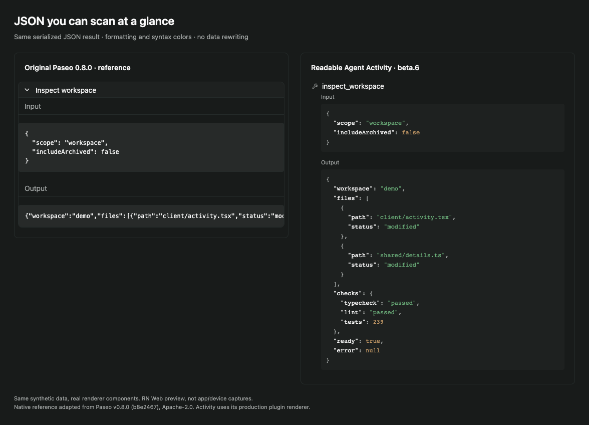
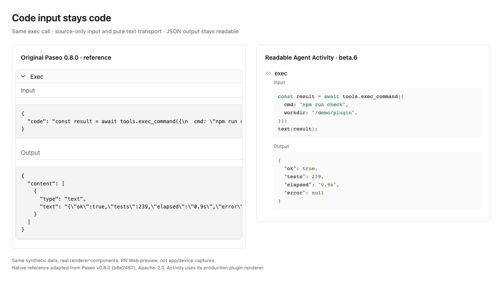
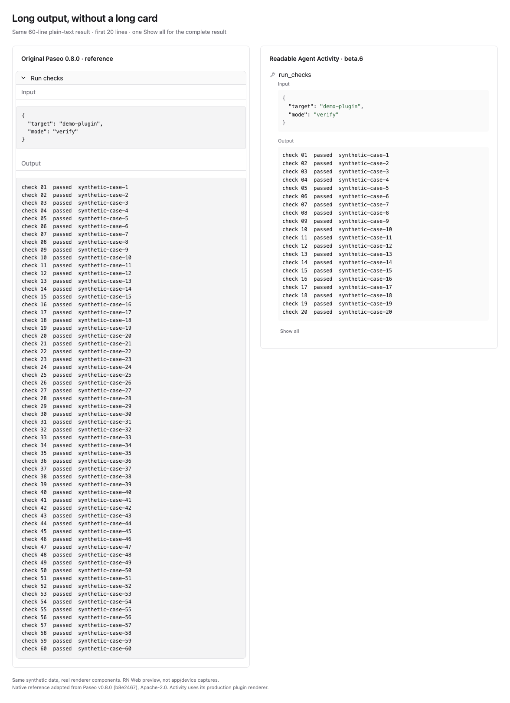

# Readable Agent Activity

**Formatted, highlighted tool-call JSON. Twenty-line previews. Recognizable tool icons.**

**Version 0.1.0-beta.7** · [Release notes](CHANGELOG.md) · Paseo 0.8/0.9, Full detail only.

## What it does

- One **Input / Output** view for ordinary tools and codex-conversion.
- Format and syntax-highlight JSON. Non-JSON text stays readable; source-only
  JavaScript inputs render in place.
- Preview at most **20 displayed lines per section**, including automatic wrapping. One **Show all / Show less**
  control expands or collapses both sections. No Raw/Copy toolbar or extra explanations.
- Keep tool-specific icons and the host's running/failed/canceled status.
- Keep expansion manual through streaming and theme updates. Text is selectable
  with real newline characters for normal device copying.

Thinking uses a minimal matching foldable header to keep alternating tool/Thinking
rows compact. Its body is selectable original text, with twenty-line preview and
Show all, **without Markdown interpretation**. Messages, approvals and the composer
stay native. The plugin does not generate summaries, infer nested calls, rebuild
diffs or add settings screens.

## Before and after

Each pair uses **the same synthetic input and output**: original Paseo 0.8.0 reference
on the left, this plugin on the right. These are real renderer components in a browser
preview, not app/device captures. [Screenshot provenance and limits](docs/screenshots.md).

### Formatted, highlighted JSON

A serialized JSON result becomes an indented, colored structure.



### Source code without the JSON wrapper

A source-only exec input displays as code; a pure text result displays its JSON content.
Extra metadata and attachment fields are preserved when present.



### Twenty-line preview for long output

Non-JSON output stays plain text. Activity shows the first twenty lines and offers
one Show all for the complete result; wrapped long lines are bounded too.



## Data and limits

JSON strings are formatted by changing whitespace only: number spellings, duplicate
keys, key order and escapes remain intact. Structured objects are already decoded data.

Only a source-only code input and a pure single-text content envelope are unwrapped.
Extra input parameters, metadata, traces, unknown blocks and attachment data remain
visible in the formatted JSON. Arbitrary nested strings are not recursively decoded.
Native typed details receive a thin Input/Output adaptation; supplied edit fields
are retained, not replaced with a reconstructed diff.

**Show all displays the complete received representation**, not an inferred summary.
It cannot restore data already omitted upstream. The preview first takes twenty source
lines, then clips wrapping to twenty line-heights. It is not independently scrollable;
Show all removes both limits. There is no additional 4,000-character preview cap.

Formatting work is capped at 1,000,000 input/output characters, with bounded indentation;
larger or malformed text remains intact as literal text. Highlighting is capped at
100,000 characters. Source serialization, long-line layout and Show all can still be expensive for
large payloads, particularly a single very long line. This is not a zero-lag guarantee.
Virtual-list remounts reset local disclosure state.

[Conversion compatibility](docs/conversion-compatibility.md) · [Verification](docs/verification.md)

## Compatibility

**Paseo 0.8.0 and 0.9.0-beta.1 · Full detail only · experimental beta.**
The manifest allows `>=0.8.0 <0.10.0`; future releases need verification.

Paseo 0.8 groups Summary calls before running plugin transformers. Its public API
exposes neither the display mode nor group members. An enabled replacement can
hide the native group's entry point; this plugin cannot automatically fall back.

Paseo 0.9 transforms each original call **before** Summary grouping. All calls now
remain visible, but plugin cards bypass grouping. Summary is still unsupported.
Native plan/approval tools pass through, preserving host suppression and expandable
plan cards. No display-mode API is available in either version.

- Use **Full detail on every connected client**.
- **Disable this plugin before switching to Summary**.
- Do not enable two plugins replacing the same tool-call timeline items.
- No host preference is changed and no private app state is inspected.

Pinned host-pipeline tests document this gap; passing them does not mean Summary
support. Hermes engine tests and compact browser previews are not on-device mobile
UI tests. [Compatibility evidence](docs/compatibility.md).

## Install and local development

Plugins are **trusted, unsandboxed code**. This plugin is client-only and uses public
SDK modules, React Native primitives and host theme colors. It has no runtime network,
filesystem, process or daemon-side behavior. Contributions unregister on cleanup.

Install the pinned prerelease on the intended daemon:

```sh
paseo plugin add geoqiao/paseo-stuff:plugins/agent-activity --ref readable-agent-activity-v0.1.0-beta.7 --host <your-host>
```

Installation enables the plugin. Review its source/trust requirements and select
Full detail first. Do not create a duplicate installation. Existing installations
may use a runtime alias such as `colorful-agent-activity`; manage that existing ID.
[Repository migration notes](https://github.com/geoqiao/paseo-stuff/blob/main/MIGRATION.md).

For local development, run from the plugin directory (Node.js 22+):

```sh
npm ci --ignore-scripts --legacy-peer-deps --no-audit --no-fund
npm run check
# Only if the existing installation is enabled:
paseo plugin reload <existing-runtime-id> --host <your-host>
paseo plugin ls --host <your-host>
```

Preserve disabled installations; do not auto-enable them. No daemon restart is needed.
Tests cover formatter fidelity, malformed/large data, complete output, text selection,
manual disclosure, streaming, icons, theme colors, the Hermes bundle and pinned host
projection. Native iOS/Android UI and the complete reconnect matrix remain unverified.

## Credits

An MIT fork of Matt Cowger's [Colorful Agent Activity](https://github.com/mcowger/paseo-plugins/tree/91058be73840ae11b130b6bb7d34b07652462217/colorful-agent-activity).
Original copyright retained: [LICENSE](LICENSE), [provenance](UPSTREAM.md).
Vendored Paseo test fixtures retain their separate Apache-2.0 license.

The three comparison images show beta.6. Earlier screenshots remain in historical release tags.
GitHub-only publication; no npm release.
[paseo.cafe submission and migration status](docs/catalog.md).
